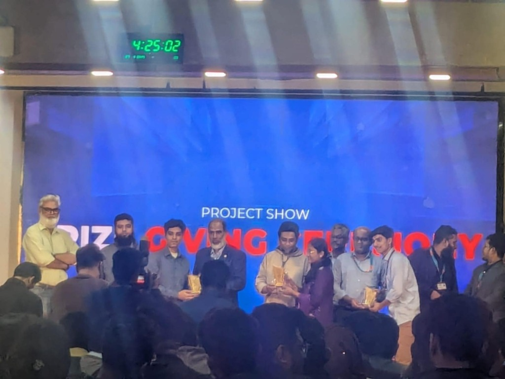
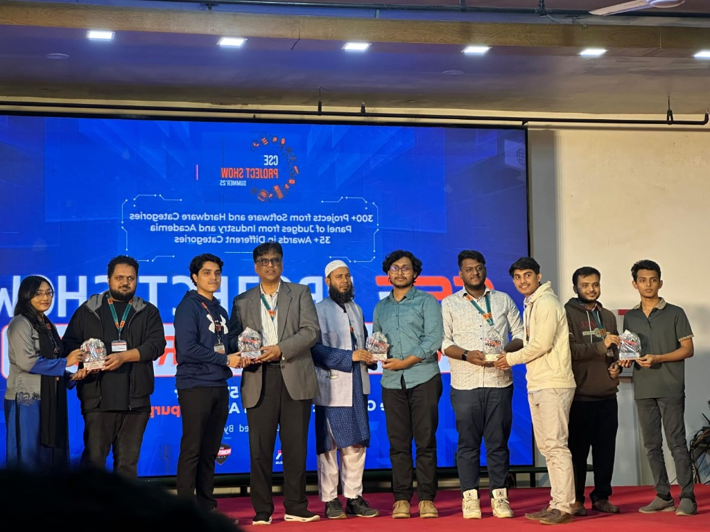

  

  # Hi, I'm **Md Abu Sayum Anik** 👋

  ### Full Stack Developer | Software Engineer | Problem Solver

  
  

---

### 👨‍💻 About Me

> I am a dedicated **Full Stack Developer** with a strong background in core programming, data structures, and scalable system design. I specialize in developing secure, optimized, and user-friendly applications with clean architecture and efficient logic.

<table>
  <tr>
    <td align="center"><b>Key Expertise</b></td>
    <td align="center"><b>Current Focus</b></td>
  </tr>
  <tr>
    <td>
      • Scalable Web App Development 
      • Database Design & Optimization 
      • API-Driven Backend (PHP, Node.js) 
      • Modern Frontend (React, JS)
    </td>
    <td>
      • Secure Full-Stack Applications 
      • Advanced DSA & System Design 
      • Multithreaded Programming 
      • Tech: C++, Java, PHP, Mysql, React
    </td>
  </tr>
</table>

### 🎓 Education

<table>
  <tr>
    <td width="100px"></td>
    <td>
      <b>United International University</b> 
      <i>B.Sc. in Computer Science & Engineering</i> | Jan 2023 - Oct 2025 
      CGPA: 3.86/4.00 | 🏆 Multiple Merit Scholarships
    </td>
  </tr>
  <tr>
    <td width="100px"></td>
    <td>
      <b>Chittagong Cantonment Public College</b> 
      <i>Higher Secondary Certificate (Science)</i> 
      GPA: 5.00/5.00
    </td>
  </tr>
  <tr>
    <td width="100px"></td>
    <td>
      <b>Adamjee Cantonment Public School</b> 
      <i>Secondary School Certificate (Science)</i> 
      GPA: 5.00/5.00
    </td>
  </tr>
</table>

### 🛠️ Technical Skills

| Category | Skills |
| :--- | :--- |
| **Languages** |      |
| **Frontend** |    |
| **Backend** |    |
| **Tools** |    |

### 🚀 Featured Projects

| Project | Description | Stack |
| :--- | :--- | :--- |
| **[Safe Space](https://github.com/Anik-tB/space-login)** | A web-based safety platform empowering communities with incident reporting and real-time alerts. | PHP, MySQL, JS |
| **[Beyond The Galaxy](https://github.com/Anik-tB/FinalBTG)** | A JavaFX space-themed RPG with multiplayer PvP, marketplace, and character progression. | Java, JavaFX |
| **[IISWPS](https://github.com/Anik-tB/IISWPS)** | AI-driven system for monitoring and predicting industrial safety workflows in real-time. | AI/ML, Full-Stack |

### 🏆 Achievements

  <table>
    <tr>
      <td align="center">
         
        <b>Champion - Beyond The Galaxy</b> 
        AOOP Course (Fall 24)
      </td>
      <td align="center">
         
        <b>1st Runner Up - Brainwave</b> 
        CSE Project Show (Spring 25)
      </td>
    </tr>
  </table>

  

### 📊 GitHub Stats

  
  

 

  

---

  ### 🤝 Connect with Me

  
  
  
  

   

  

  ⭐ Crafted by <a href="https://github.com/Anik-tB">Md Abu Sayum Anik</a>

